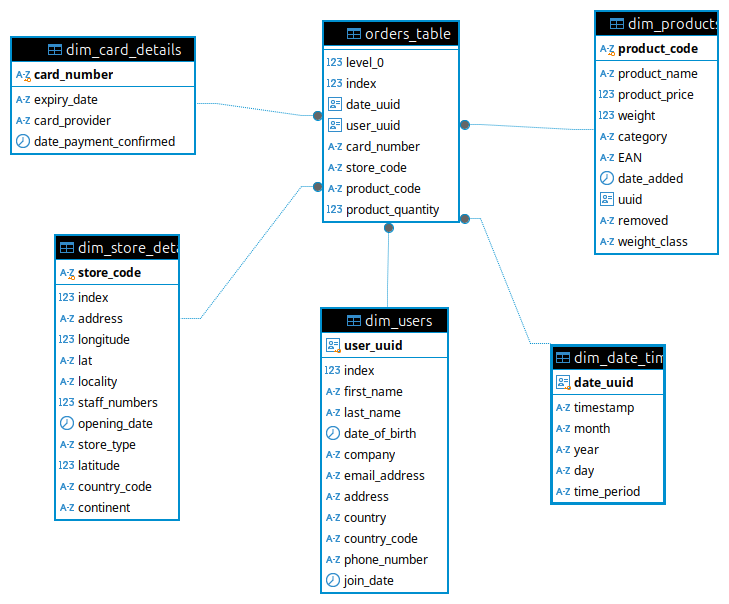

# Project Title: Sales Data Extraction and Validation


## Table of Contents
1. [Project Description](#project-description)
2. [Continuous Integration](#continuous-integration)
3. [Installation](#installation)
4. [Usage](#usage)
5. [File Structure](#file-structure)
6. [License](#license)

## Project Description

This project is designed to automate the extraction, validation, and storage of sales data from various sources. It facilitates efficient data handling processes, ensuring data integrity by leveraging validation through Pydantic models. The goal is to clean and process large datasets before storing them in a PostgreSQL database for further analysis and reporting.


## The following Entity-Relationship Diagram (ERD) represents the structure of the PostgreSQL database used in this project:



### Key Features:

- Data Extraction from Multiple Sources:
Extract sales data from various sources such as CSV, API endpoints, and AWS S3 stored files (JSON).
- Data Validation Using Pydantic:
Pydantic models ensure the integrity of incoming data by validating its structure and content before processing.
- Data Cleaning:
Data is cleaned and normalized, ensuring consistency across sources.
- Data Storage in PostgreSQL:
Processed and validated data is stored in a PostgreSQL database for future use and analysis.
- AWS S3 Integration:
JSON files are fetched from AWS S3 storage, allowing for seamless integration of cloud data sources.
- Error Logging and Reporting:
Logs are maintained for tracking validation errors, failed extractions, and other pipeline issues.
- Automated Workflow:
The entire pipeline can be scheduled and automated for regular data ingestion and storage.

### Technology involved:

- Programming Language: Python 3.8, handling large datasets in Python
- Data Validation: Pydantic (v2)
- Database: PostgreSQL
- Cloud Storage: AWS S3
- Data Handling Libraries:
    . Pandas for data manipulation
    . SQLAlchemy for database operations
    . Requests for API interactions
- Testing: Unittest framework
- Logging: Python's logging module for capturing errors and tracking process flows.

## Continuous Integration

This project utilizes GitHub Actions for Continuous Integration (CI). The CI workflow is triggered on every push or pull request to the repository. It includes the following steps:

1. **Checkout Code**: The latest code is checked out from the repository.
2. **Set Up Secrets**: Environment variables for database credentials are securely created from GitHub Secrets.
3. **Python Setup**: The project runs on Python 3.8, and dependencies are installed.
4. **Run Tests**: Automated tests are executed using the unittest framework to ensure code quality and functionality.
5. **Clean Up**: Sensitive information is removed after the workflow completes.

You can view the CI status and logs [here](https://github.com/Michaelaicore/multinational-retail-data-centralisation312/actions).


## Installation
1. Clone the repository:

```bash
git clone https://github.com/Michaelaicore/multinational-retail-data-centralisation312.git
cd multinational-retail-data-centralisation312
```

2. **Create and activate your Python environment.** If you are using a virtual environment, activate it by running:

```bash
python3 -m venv env
source env/bin/activate
```
3. **Ensure you have all necessary dependencies installed.** If you haven't already set up your environment, you may need to install dependencies using `pip`:

```bash
pip install -r requirements.txt
```
4. **Set up your AWS credentials in ~/.aws/credentials.** 

    4.1 ***Install AWS CLI*** If you haven't instal AWS CLI, go to [link](https://aws.amazon.com/cli/), follow the instruction to install AWS CLI regarding to your system. 

    4.2 ***Open AWS account, and get access key pair*** Sign up a AWS account, follow the [instruction](https://repost.aws/knowledge-center/create-access-key) to get your access key.

    4.3 ***Configure AWS CLI*** run following code, use access key pair complete the setup [process](https://docs.aws.amazon.com/cli/v1/userguide/cli-configure-files.html#cli-configure-files-methods)

```bash
aws configure
```
5. **Install and configure your PostgreSQL database settings in the environment variables.**

    5.1 ***Create a database named sales_data***

```bash
sudo -u postgres psql
CREATE DATABASE sales_data;

```

    5.2 ***Create original and target(local) database access credentials***

        . Source database credential in yaml file, db_creds.yaml, in root directory in project as following format:

```bash
RDS_HOST: *********************
RDS_PASSWORD: **********************
RDS_USER: **************
RDS_DATABASE: **********************
RDS_PORT: **********************
```
        . Target basebase credential in yaml file, target_db_creds.yaml, in following format:

```bash
RDS_HOST: localhost
RDS_PASSWORD: ***************
RDS_USER: ***************
RDS_DATABASE: sales_data
RDS_PORT: ***************
header:
{"x-api-key": ***************}
number_of_stores_endpoint: ***************
store_details_endpoint: ***************
product_table_link: ***************
date_model_link: ***************
card_details_link: ***************
```

## Usage 

1. Run the data extraction script:
    
    ```bash
    python -m main/data_extraction.py
    ```
  
    This will start the data extraction process, and during the execution, two types of logs will be generated:

    Invalid Data Log: Logs containing invalid data or rows that failed the validation process will be saved in the data_cleaning_invalid_data.csv file, organized by model type (e.g., OrderModel, ProductModel).

    Validation Errors Log: Any validation errors that occur will be recorded in the data_cleaning_errors.log file for each model.

    Important: Ensure that no valid data is included in these logs. If valid data appears in the invalid data files, it means the validation criteria in the DataCleaning.py file need to be amended. Review the logic in the DataCleaning.py file to ensure the validation rules are properly configured.

2.  Execute the SQL scripts provided in the project to update or query the database schema:

    schema_setting.ipynb and schema_setting.sql: These scripts handle schema settings for the database. Run the .ipynb file using Jupyter Notebook or the .sql file directly in your SQL environment.

    SQL_querying.ipynb and SQL_querying.sql: These scripts perform SQL queries on the data. Like the schema script, you can run the .ipynb in Jupyter or execute the .sql file in your SQL environment.

## File Structure

```bash
multinational-retail-data-centralisation312/
.
├── db_creds.yaml
├── __init__.py
├── logging
│   ├── DateModel
│   │   ├── data_cleaning_errors.log
│   │   └── data_cleaning_invalid_data.csv
│   ├── OrderModel
│   │   └── data_cleaning_errors.log
│   ├── PaymentModel
│   │   ├── data_cleaning_errors.log
│   │   └── data_cleaning_invalid_data.csv
│   ├── ProductModel
│   │   ├── data_cleaning_errors.log
│   │   └── data_cleaning_invalid_data.csv
│   ├── StoreModel
│   │   ├── data_cleaning_errors.log
│   │   └── data_cleaning_invalid_data.csv
│   └── UserModel
│       ├── data_cleaning_errors.log
│       └── data_cleaning_invalid_data.csv
├── main
│   ├── database_utils.py
│   ├── data_cleaning.py
│   ├── data_extraction.py
│   └── __init__.py
├── README.md
├── requirements.txt
├── schema_setting.ipynb
├── schema_setting.sql
├── SQL_querying.ipynb
├── SQL_querying.sql
├── target_db_creds.yaml
└── test
    ├── __init__.py
    ├── test_database_utils.py
    ├── test_data_cleaning.py
    └── test_data_extraction.py
```

## License
This project is licensed under the MIT License - see the LICENSE [file](https://opensource.org/license/mit) for details.